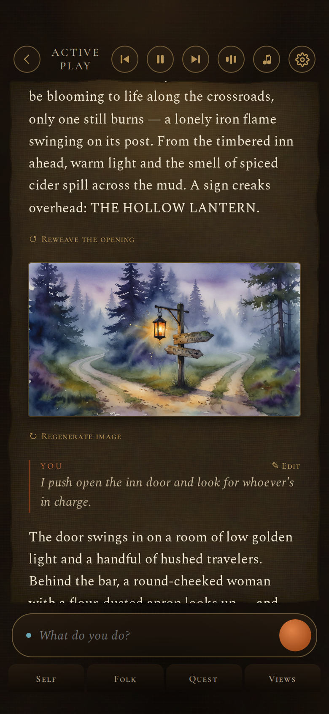
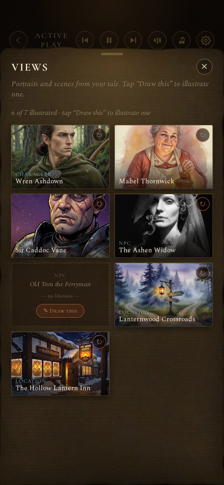
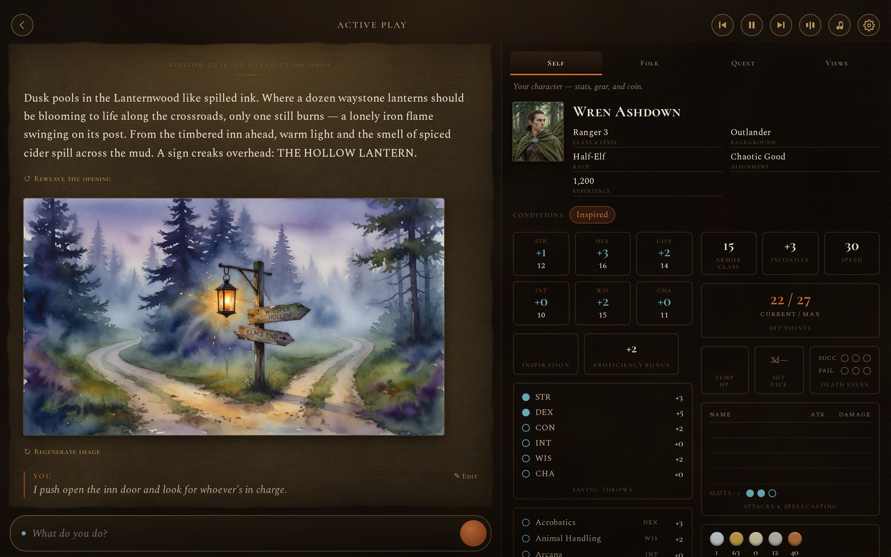

# Chronicle

**Your personal, private Dungeon Master — right on your own computer.**

Chronicle is a beautiful, mobile-first solo Dungeons & Dragons app. A patient AI
storyteller runs the game, remembers every detail of your world, and keeps
perfect continuity from one session to the next. You play from your phone or
tablet; everything stays private on your home Wi-Fi.

It feels like opening a leather-bound journal with warm parchment pages and
candlelight — a Dungeon Master who is always ready, never gets tired, and never
forgets what happened last time.

  
  
  

## Get started

Chronicle works on **Windows, Mac, and Linux**. Setup takes about 20–30 minutes
the first time, and you only do it once. Pick your computer and follow the
simple, picture-guided steps:

- 🪟 **[I use Windows →](docs/user-guide/install/windows.md)**
- 🍎 **[I use a Mac →](docs/user-guide/install/mac.md)**
- 🐧 **[I use Linux →](docs/user-guide/install/linux.md)**

New here and not sure where to begin? Start with the **[User Guide](docs/user-guide/index.md)** —
it walks you through everything, one calm step at a time.

## What you'll need

- A Windows, Mac, or Linux computer (laptop or desktop)
- A phone or tablet on the **same home Wi-Fi**
- A **Claude account** (a Claude Pro or Max subscription powers the storyteller —
  the guide shows you how to sign in)
- About 20–30 minutes the first time

## Learn more

- 📖 **[User Guide](docs/user-guide/index.md)** — start here
- 🖼️ **[Adding pictures](docs/user-guide/adding-pictures.md)** — optional illustrations of your world
- 🎨 **[Customizing your story](docs/user-guide/customizing-your-story.md)** — art styles, world flavor, tone
- 🆘 **[Help & troubleshooting](docs/user-guide/help-and-troubleshooting.md)** — calm fixes for common hiccups

---

Your stories stay safe and private — nothing ever leaves your home network.

**Ready to begin?** Pick your computer above and let's get your personal Dungeon
Master set up. You've got this. 🕯️

Building on Chronicle or curious how it works? See the **[Developer & Architecture Guide](docs/developer-guide.md)**.
