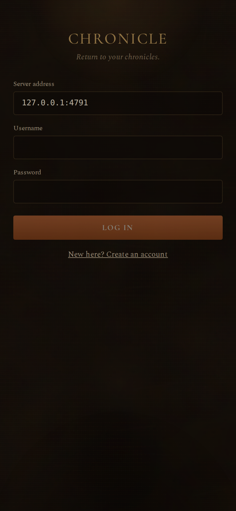
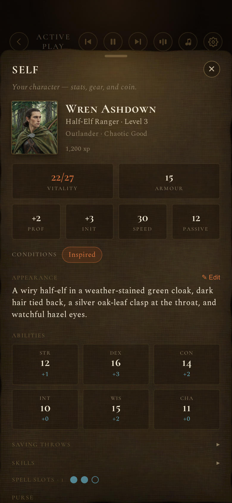
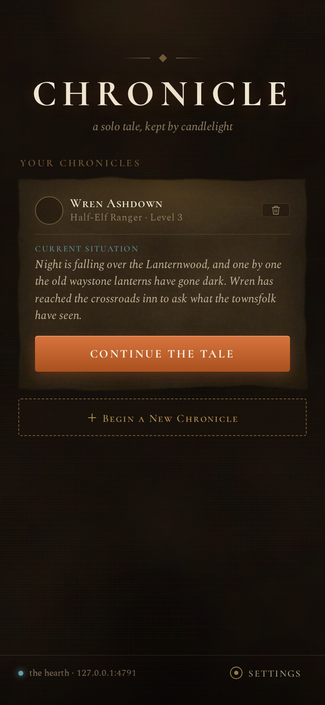

# Starting Your First Adventure

You’ve done the setup. Your storyteller is running on the computer.  
Now the fun begins.

---

## Open Chronicle on Your Phone or Tablet

1. On your phone or tablet, open any modern browser (Safari, Chrome, Firefox, Edge — all work).

2. In the address bar, carefully type the full address you wrote down earlier.  
   It looks like this:

   ```
   http://192.168.1.42:4317
   ```

   (Use **your** number from the “listening on http://...” message.)

3. Press Go / Enter.

You’ll land on a simple welcome screen.



---

## Create Your Account (First Time Only)

The very first time, you make your own little account so the storyteller knows
which chronicles are yours. Everyone in your home who plays gets their own — and
you each only ever see your own adventures.

1. Tap **Create account**.
2. Pick a **username** (anything you like — `wren`, `kris`, `dragonfan`).
3. Pick a **password** you’ll remember.
4. Tap **Create account** again to finish.

That’s it — no secret codes or keys to type. From now on you’ll just **Log in**
with the same username and password on any device.

If everything is correct, the beautiful leather-and-parchment interface will appear.

**Congratulations — you’re inside Chronicle!** 🕯️

---

## Create Your First Campaign

Chronicle calls each adventure a **chronicle**.

1. Tap **New chronicle** (or **Start a new story**).

2. Create your character — choose a race and class, and Chronicle shows you a
   live preview of your hero as you go.

3. Give your chronicle a name you love (examples: “The Whispering Vale”,
   “Shadows of Eldrath”, “My First Solo Saga”).

4. If you like, set the mood — world flavor, tone, and art style. You can change
   all of this later, so don’t overthink it. (See
   **[Customizing Your Story](customizing-your-story.md)**.)

5. Tap **Begin**.

Your Dungeon Master will set the opening scene and invite you into the story.


---

## Take Your First Turn

In the **Story** view you’ll see the opening narration.

Below it is a text box that says something like “What do you do?”

Type what your character does, for example:

- “I draw my sword and step into the torchlit tavern.”
- “I ask the old woman at the bar if she’s seen any strange lights in the forest.”
- “I quietly examine the ancient map on the wall.”

You can also tap any **suggested actions** that appear — they’re helpful when
you’re not sure what to do next.

Press Send (the paper-plane icon).

The storyteller responds with rich narration, updates your character sheet
automatically, and remembers everything that happened.


---

## Finding Your Way Around

Along the bottom (on a phone) or the side (on a bigger screen) you’ll find a few
tabs. Tap any of them to peek, then tap away to return to the story:

- **Self** — your character sheet: hit points, inventory, gold, and more.
- **Folk** — everyone you’ve met, with their portraits.
- **Quest** — your active and finished quests.
- **Views** — a gallery of the pictures from your world.

A small **gear** opens this chronicle’s settings (tone, world flavor, art
style, music).



Most of your time is spent right in the **Story** view, talking with your
personal Dungeon Master and watching your world grow.

---

## A Few Things to Know Right Away

- **Everything saves automatically.** You can close the app and come back later —
  just reopen the same address on your phone and you’ll still be logged in. Your
  chronicles are waiting on the home screen:

  

- **The black/terminal window on your computer** can stay minimized. As long as
  it’s open, the storyteller is listening.
- **If you close that window**, the storyteller stops. Just reopen the chronicle
  folder, open Terminal / PowerShell there again, and run `npm start` once more.
- **Pictures are off by default.** The game works beautifully without them. You
  can turn on illustrations later in **Settings → The Look** if you want the
  world to come alive visually (see **[Adding Pictures](adding-pictures.md)**).

---

## You’re Ready to Play

That’s really all there is to it. Welcome to Chronicle.  
Your story begins now. ✨

---

**Next up (optional but lovely):**  
When you’re ready, visit **[Customizing Your Story](customizing-your-story.md)** to adjust the tone, whimsy, art style, and world flavor so the storyteller matches exactly the kind of D&D you love most.

Or just keep playing — your first session is waiting.

---

*If anything on the phone looks a little different from the pictures here, that’s okay — the interface is designed to feel familiar and intuitive. Just explore the tabs and you’ll quickly get the hang of it.*
